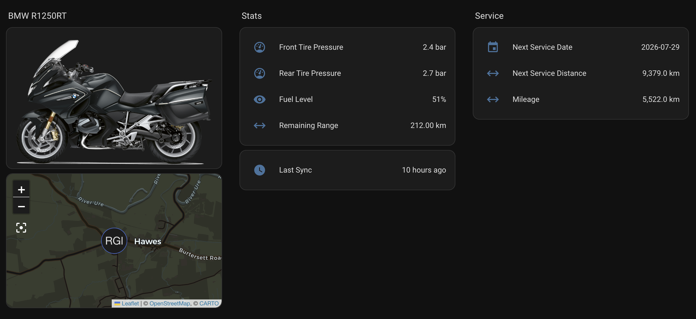

# BMW Connected Ride for Home Assistant

[![HACS][hacs-badge]][hacs-url]
[![License: MIT][license-badge]][license-url]

[hacs-badge]: https://img.shields.io/badge/HACS-Custom-41BDF5.svg
[hacs-url]: https://hacs.xyz
[license-badge]: https://img.shields.io/badge/License-MIT-yellow.svg
[license-url]: LICENSE

A Home Assistant custom integration for BMW motorcycles using the BMW Connected Ride API. Exposes motorcycle telemetry as sensors, a GPS device tracker, and motorcycle images.

## Features

- Fuel level and remaining range
- Energy level and electric range (electric/hybrid models)
- Front and rear tire pressures
- Odometer (mileage)
- Trip distance
- Next service date and distance to service
- GPS device tracker
- Motorcycle images (side views, rider views, color tiles)

## Installation

1. Install [HACS](https://hacs.xyz) if not already installed
2. In HACS, go to Integrations and click the three-dot menu
3. Select "Custom repositories"
4. Add the repository URL and select "Integration" as the category
5. Search for "BMW Connected Ride" and install
6. Restart Home Assistant
7. Go to Settings > Devices & Services > Add Integration > search "BMW Connected Ride"

## Disclaimer

BMW, Connected Ride, and Motorrad are trademarks of BMW AG. This project is not endorsed by, affiliated with, or sponsored by BMW AG. This integration uses unofficial BMW APIs that may change or be discontinued without notice.

## License

This project is licensed under the MIT License - see the [LICENSE](LICENSE) file for details.
